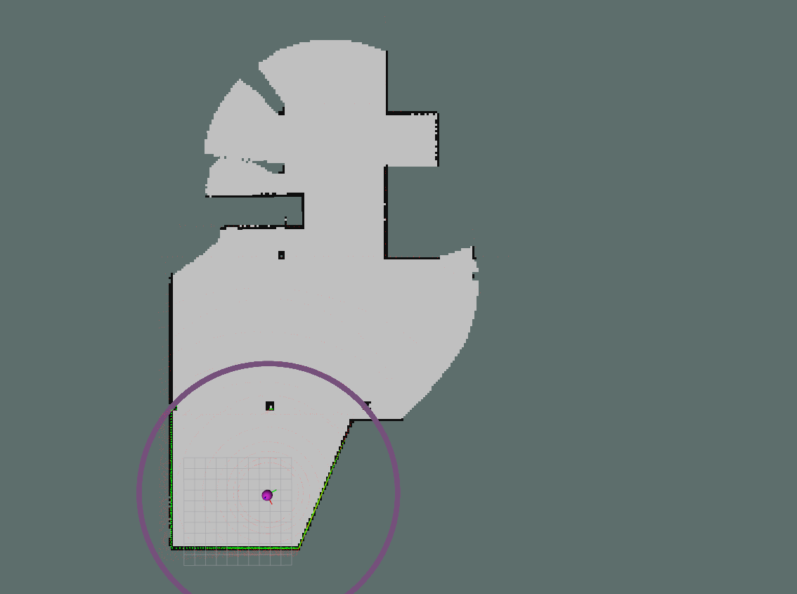

# 全局占用栅格图构建功能包 
## 使用环境
- ROS noetic
- Ubuntu 20.04  
## 功能   
接收配准后的16线激光雷达数据和里程计数据，构建全局占用栅格地图，并发布。     


## 参数配置
所有参数可通过launch文件或命令行配置：

### 输入话题
- /registered_scan (sensor_msgs/PointCloud2)
  - 输入的点云数据，要求已经过配准处理
- /state_estimation_at_scan (nav_msgs/Odometry)
  - 输入的里程计数据，传感器的位姿

### 输出话题  
- /projected_laserscan (sensor_msgs/LaserScan)
  - 将多线激光雷达投影到XY平面后的单线激光数据，用于可视化
- /grid_map (nav_msgs/OccupancyGrid)
  - 输出的全局占用栅格地图

### 参数

  - height_threshold_low: 点云最低高度阈值 (默认: 0.2m)
    - 低于此高度的点云将被过滤，用于多线雷达投影成单线雷达。
  - height_threshold_high: 点云最高高度阈值 (默认: 0.8m)
    - 高于此高度的点云将被过滤，用于多线雷达投影成单线雷达。
  - scan_range_min: 单线雷达最小范围
  - scan_range_max：投影成的单线雷达最大范围
  - circle_points_num：采样圆形边的采样点的个数
    - 个数越多，自由空间越多
  - resolution: 栅格地图分辨率
  - gridmap_width: 栅格地图的边长（栅格个数）

## 编译方法
1. 创建工作空间并初始化
```bash
mkdir -p ~/catkin_ws/src
cd ~/catkin_ws/src
catkin_init_workspace
```

2. 克隆代码到src目录
```bash
git clone https://github.com/JiaWenHa/lidar_to_gridmap.git
```

3. 编译项目
```bash
cd ~/catkin_ws
catkin_make
source devel/setup.bash
```

## 运行方法
该功能包需要接受雷达点云数据和里程计数据。
### 仿真运行
1. 启动节点：
```bash
roslaunch lidar_to_gridmap lidar2gridmap.launch
```
2. 播放bag包
```bash
cd 工作空间/src/lidar_to_gridmap/bags
rosbag play test.bag
```

### 实物运行
1. 启动3D SLAM程序，该程序要能发布配准后的点云和雷达里程计，这两个的frame_id都为map。
2. 启动节点：
```bash
roslaunch lidar_to_gridmap lidar2gridmap.launch
```

## 效果图
运行效果图如下所示，图中黑色为障碍物，白色为自由栅格，灰色为未知栅格。紫色圆弧为雷达的探测范围，
该范围可以随意调整。


## 实现原理   
如果算法刚初始化且机器人在起始点位置附近，采用单线雷达的方法更新栅格状态，否则使用地形点云更新栅格状态。   

注：单线雷达点由多线雷达投影到XY平面上得到。
### 单线雷达点云更新栅格方法(已经实现)
- 先根据障碍物点云的位置，使用Bresenham算法更新栅格占用状态；   
- 从机器人当前位置进行采样，采样一圈半径为R的圆形边界点，用射线法更新周围栅格占用状态。更新原则：
碰到占用栅格则停止当前射线上的栅格更新，当前位置到采样点之间的射线上的栅格的状态更新为自由态。   
### **地形点云更新栅格状态的方法（有斜坡的时候使用这个方法，对于室内环境可以使用单线雷达点云更新栅格的方法）**   
将点云投影到地面，获取地面栅格中包含的高度最低和最高的点云，如果最高和最低点云的高度差大于threshold值，则表示这个栅格是被占用的。更新对应栅格为占用状态。   
从机器人当前位置进行采样，采样一圈半径为R圆形边界点，用射线法更新栅格占用状态，碰到占用栅格则停止当前射线上的栅格更新，当前位置到占用栅格中间的射线上的栅格状态设置为自由。
